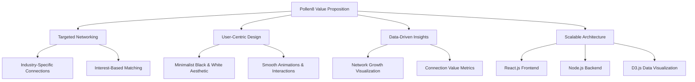
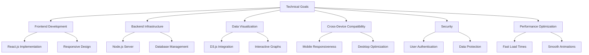
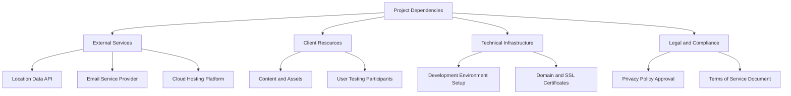
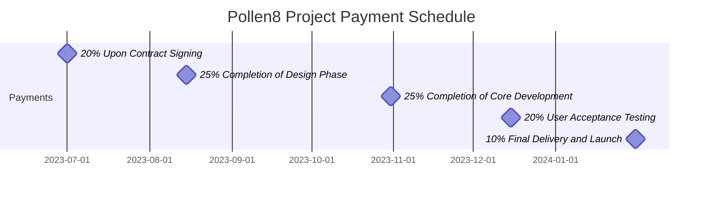
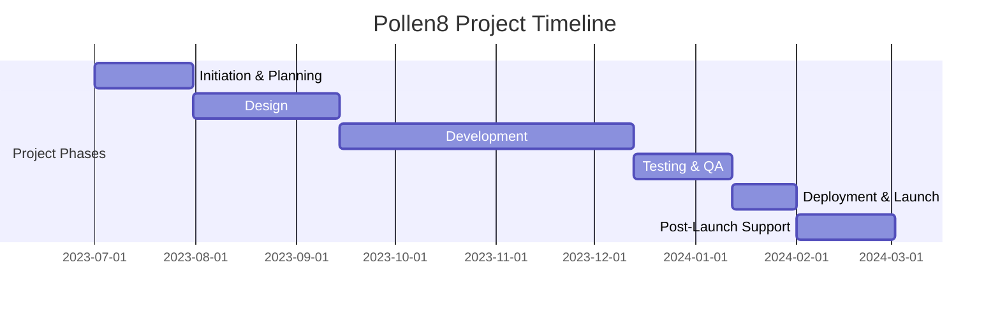
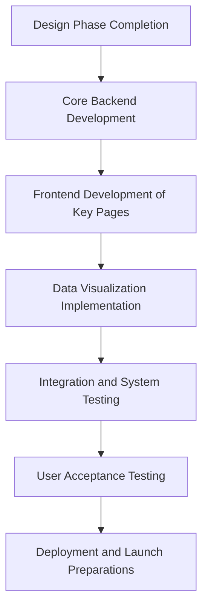
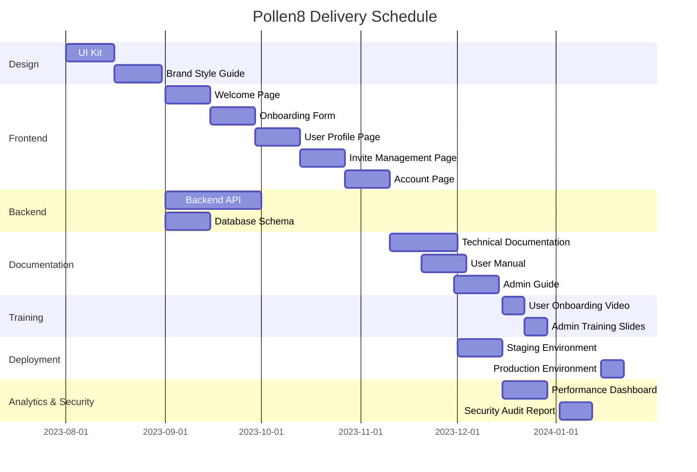

## EXECUTIVE SUMMARY

### PROJECT OVERVIEW

Pollen8 is a cutting-edge web platform designed to revolutionize professional networking and industry connections. The client's need stems from the increasing difficulty professionals face in building meaningful connections and navigating complex industry landscapes. Our proposed solution addresses this by creating a sleek, user-friendly platform that facilitates targeted networking, industry-specific connections, and value-driven relationship building.

The platform utilizes a minimalist black-and-white design, emphasizing user experience through smooth animations and intuitive interactions. By leveraging React.js, Node.js, and D3.js, Pollen8 offers a robust, responsive, and data-driven environment for users to expand their professional networks efficiently.

### OBJECTIVES

1. Create a seamless onboarding process that captures essential user information
2. Develop an intuitive invite management system to facilitate network growth
3. Implement a dynamic user profile page that showcases connections and network value
4. Design an interactive account page for managing industry networks and viewing connection analytics
5. Integrate data visualization tools to provide users with insights into their network growth and value

### VALUE PROPOSITION

Our agency offers a unique combination of technical expertise and design innovation that sets Pollen8 apart from traditional networking platforms:

1. **Targeted Networking**: By focusing on industry-specific connections and interest-based matching, we ensure that users build relevant and valuable professional relationships.

2. **User-Centric Design**: Our minimalist black-and-white aesthetic, coupled with smooth animations and intuitive interactions, creates an engaging and distraction-free environment for networking.

3. **Data-Driven Insights**: Leveraging D3.js, we provide users with powerful visualizations of their network growth and connection value, enabling them to make informed decisions about their networking strategies.

4. **Scalable Architecture**: Built on React.js and Node.js, Pollen8 is designed to handle growing user bases and evolving feature sets, ensuring long-term viability and adaptability.

By combining these elements, our agency delivers a networking platform that not only meets the client's immediate needs but also positions them at the forefront of professional connection technology.

## PROJECT OBJECTIVES

### BUSINESS GOALS

1. Revolutionize professional networking by providing a targeted, industry-specific platform
2. Increase user engagement and retention through an intuitive, minimalist design
3. Enhance the value of professional connections by offering data-driven insights
4. Establish Pollen8 as a leading platform for high-quality industry networking
5. Generate revenue through premium features and targeted advertising opportunities

### TECHNICAL GOALS

1. Develop a scalable and responsive web application using React.js for the frontend
2. Implement a robust backend infrastructure using Node.js to handle user data and connections
3. Integrate D3.js for creating interactive and insightful data visualizations
4. Ensure seamless cross-device compatibility and responsiveness
5. Implement secure user authentication and data protection measures
6. Optimize performance for fast load times and smooth user interactions

### SUCCESS CRITERIA

| Metric | Target | Measurement Method |
|--------|--------|---------------------|
| User Acquisition | 100,000 users within 6 months of launch | Analytics dashboard |
| User Retention | 70% monthly active users | Monthly active user reports |
| Network Growth | Average of 50 connections per user within 3 months | User profile statistics |
| Platform Performance | Page load time under 2 seconds | Performance monitoring tools |
| User Satisfaction | 4.5/5 star rating on app stores | User reviews and ratings |
| Industry Diversity | Representation from at least 20 different industries | User profile data analysis |
| Data Visualization Engagement | 80% of users interact with network visualizations weekly | Feature usage tracking |
| Invite Conversion Rate | 40% of sent invites result in new user sign-ups | Invite tracking system |
| Revenue Generation | Break-even within 18 months of launch | Financial reports |
| Mobile Usage | 60% of total user engagement from mobile devices | Device usage analytics |

These success criteria will be continuously monitored and evaluated throughout the project lifecycle to ensure that Pollen8 meets its business and technical objectives. Regular reviews and adjustments will be made based on these metrics to optimize the platform's performance and user satisfaction.

## SCOPE OF WORK

### IN-SCOPE

The following tasks, features, and functionalities are included in the Pollen8 project:

1. Frontend Development (React.js)
   - Welcome Page with animated text and user onboarding
   - Onboarding Form with industry, interest, and location selection
   - User Profile Page with metadata grid and action buttons
   - Invite Management Page with link generation and tracking
   - Account Page with network visualization and user feed
   - Responsive design for mobile and desktop devices
   - Smooth animations and transitions throughout the platform

2. Backend Development (Node.js)
   - User authentication and authorization system
   - Database management for user profiles, connections, and invites
   - API endpoints for all frontend functionalities
   - Integration with third-party services for location data

3. Data Visualization (D3.js)
   - Network growth line graph on the Account Page
   - Link activity graph in the Invite Management Page
   - Interactive star constellation animation on the Account Page

4. Styling and UI/UX
   - Implementation of black-and-white minimalist design
   - Custom CSS using Tailwind for consistent styling across all pages
   - Responsive layout for various screen sizes

5. Performance Optimization
   - Code splitting and lazy loading for improved load times
   - Image optimization and caching strategies
   - Server-side rendering for initial page load

6. Security Implementation
   - Secure user authentication with encryption
   - Data protection measures for user information
   - HTTPS implementation for all communications

7. Testing and Quality Assurance
   - Unit testing for frontend and backend components
   - Integration testing for API endpoints
   - User acceptance testing for all features

8. Deployment and DevOps
   - Setup of development, staging, and production environments
   - Continuous Integration/Continuous Deployment (CI/CD) pipeline
   - Monitoring and logging systems for production environment

### OUT-OF-SCOPE

The following items are explicitly excluded from the project scope:

1. Native mobile applications (iOS/Android)
2. Integration with external social media platforms
3. Multi-language support (initially English-only)
4. Advanced analytics dashboard for administrators
5. Custom email server setup (will use third-party email service)
6. Offline functionality or PWA features
7. Video or voice chat capabilities
8. Blockchain or cryptocurrency integration
9. AI-powered recommendation system (may be considered for future phases)
10. Custom CMS for content management

### ASSUMPTIONS

The project plan is based on the following assumptions:

1. The client will provide timely feedback and approvals at designated project milestones.
2. The client has secured necessary rights and licenses for all content and assets provided.
3. Third-party APIs and services (e.g., location data) will remain available and compatible throughout the development process.
4. The project team will have uninterrupted access to required development tools and environments.
5. The client's target user base has reliable internet connectivity and uses modern web browsers.
6. The initial launch will focus on a single geographic market (to be specified by the client).
7. The client will handle all legal and compliance requirements related to data protection and privacy laws.
8. The development team has the necessary expertise in React.js, Node.js, and D3.js.

### DEPENDENCIES

The following dependencies may impact the project timeline or deliverables:

1. External Services:
   - Availability and reliability of the chosen location data API
   - Setup and integration of the selected email service provider
   - Provisioning of cloud hosting services (e.g., AWS, Google Cloud)

2. Client Resources:
   - Timely provision of content, including industry lists and interest categories
   - Availability of client stakeholders for regular meetings and approvals
   - Recruitment of user testing participants for UAT phase

3. Technical Infrastructure:
   - Procurement and setup of development and staging environments
   - Acquisition of domain name and SSL certificates

4. Legal and Compliance:
   - Approval of privacy policy and terms of service documents
   - Compliance verification with relevant data protection regulations (e.g., GDPR, CCPA)

5. Third-Party Libraries:
   - Compatibility of chosen React.js, Node.js, and D3.js versions
   - Availability of required npm packages and their maintenance status

6. Design Assets:
   - Delivery of final design mockups and assets from the design team
   - Approval of the UI kit and design system

7. Performance Benchmarks:
   - Establishment of performance criteria for page load times and API response times
   - Availability of testing tools and environments for performance optimization

8. Security Audits:
   - Scheduling and completion of security assessments
   - Implementation of any critical security recommendations

By clearly defining these in-scope items, out-of-scope elements, assumptions, and dependencies, we establish a comprehensive framework for the Pollen8 project, ensuring alignment between all stakeholders and setting the foundation for successful project execution.

## BUDGET AND COST ESTIMATES

### COST BREAKDOWN

The following table provides a detailed breakdown of the project costs for the Pollen8 platform:

| Category | Item | Cost (USD) |
|----------|------|------------|
| Labor | Frontend Development (React.js) | $45,000 |
| Labor | Backend Development (Node.js) | $40,000 |
| Labor | Data Visualization (D3.js) | $20,000 |
| Labor | UI/UX Design | $15,000 |
| Labor | Project Management | $25,000 |
| Labor | Quality Assurance | $15,000 |
| Software | Development Tools and Licenses | $5,000 |
| Infrastructure | Cloud Hosting (1 year) | $12,000 |
| Infrastructure | SSL Certificates | $500 |
| Services | Third-party APIs (Location Data, etc.) | $3,000 |
| Marketing | Initial Launch Campaign | $10,000 |
| Contingency | 10% of total budget | $19,050 |
| **Total** | | **$209,550** |

### PAYMENT SCHEDULE

The proposed payment schedule is tied to project milestones and deliverables:

1. 20% ($41,910) - Upon contract signing and project initiation
2. 25% ($52,387.50) - Completion of design phase and approval of UI/UX mockups
3. 25% ($52,387.50) - Completion of core development (frontend and backend)
4. 20% ($41,910) - Successful completion of User Acceptance Testing
5. 10% ($20,955) - Final delivery, launch, and handover of all project assets

### BUDGET CONSIDERATIONS

Several factors could potentially impact the budget, and we have strategies in place to manage these risks:

1. **Scope Creep**: 
   - Risk: Additional features or changes requested during development.
   - Mitigation: Clearly defined scope document, change request process with associated costs.

2. **Technology Changes**: 
   - Risk: Updates to React.js, Node.js, or D3.js during development.
   - Mitigation: Version lock at project start, assess impact of critical updates only.

3. **Third-party API Costs**: 
   - Risk: Unexpected increase in usage or pricing of location data API.
   - Mitigation: Explore multiple providers, implement usage caps, consider building internal solution for high volumes.

4. **Cloud Hosting Costs**: 
   - Risk: Higher than anticipated server requirements due to rapid user growth.
   - Mitigation: Implement auto-scaling with cost alerts, optimize database queries and caching.

5. **Extended Timeline**: 
   - Risk: Delays in development or approval processes extending the project duration.
   - Mitigation: Detailed project plan with buffer, regular progress reviews, clear client communication protocols.

6. **Security Enhancements**: 
   - Risk: Additional security measures required after initial security audit.
   - Mitigation: Comprehensive security planning in initial phases, allocate part of contingency budget for potential enhancements.

7. **Performance Optimization**: 
   - Risk: Additional time needed to meet performance benchmarks.
   - Mitigation: Early and continuous performance testing, optimize critical paths first.

8. **Currency Fluctuations**: 
   - Risk: For international clients, exchange rate changes could affect the budget.
   - Mitigation: Include a currency fluctuation clause in the contract, consider fixed exchange rate for the project duration.

To manage these considerations:

- We have included a 10% contingency in the budget to address unforeseen circumstances.
- Regular budget reviews will be conducted as part of project management to identify and address any potential overruns early.
- Clear communication channels will be established with the client to discuss any budget implications of requested changes or unforeseen challenges.
- The project manager will maintain a risk register, regularly updating and addressing potential budget impacts throughout the project lifecycle.

By carefully managing these budget considerations and maintaining transparent communication with the client, we aim to deliver the Pollen8 platform within the proposed budget while ensuring high-quality output and client satisfaction.

## TIMELINE AND MILESTONES

### PROJECT TIMELINE

The Pollen8 project will be executed over a 7-month period, divided into the following major phases:

### KEY MILESTONES

| Milestone | Description | Target Date |
|-----------|-------------|-------------|
| M1: Project Kickoff | Contract signed, team assembled, project charter approved | 2023-07-01 |
| M2: Design Approval | UI/UX designs and prototypes approved by client | 2023-08-15 |
| M3: Development Sprint 1 Complete | Core functionality for Welcome and Onboarding pages | 2023-09-30 |
| M4: Development Sprint 2 Complete | User Profile and Invite Management pages | 2023-10-31 |
| M5: Development Sprint 3 Complete | Account page and data visualizations | 2023-11-30 |
| M6: Testing Complete | All features tested, major bugs resolved | 2024-01-05 |
| M7: Platform Launch | Pollen8 goes live to users | 2024-01-31 |
| M8: Post-Launch Review | Gather initial user feedback, performance metrics | 2024-02-29 |

### CRITICAL PATH

The following tasks represent the critical path for the Pollen8 project:

1. **Design Phase Completion** (45 days)
   - Crucial for setting the visual direction and user experience
   - Delays here will impact all subsequent development tasks

2. **Core Backend Development** (30 days)
   - Includes user authentication, database setup, and API foundations
   - Essential for all frontend features to function properly

3. **Frontend Development of Key Pages** (60 days)
   - Welcome, Onboarding, User Profile, and Invite Management pages
   - These pages form the core user journey and are essential for MVP

4. **Data Visualization Implementation** (20 days)
   - Integration of D3.js for network graphs and analytics
   - Critical for delivering the unique value proposition of Pollen8

5. **Integration and System Testing** (20 days)
   - Ensures all components work together seamlessly
   - Identifies any critical issues before user acceptance testing

6. **User Acceptance Testing** (10 days)
   - Final validation of the platform with client stakeholders
   - Last opportunity for major adjustments before launch

7. **Deployment and Launch Preparations** (10 days)
   - Includes final security checks, performance optimization, and launch strategy execution
   - Critical for ensuring a smooth public release

To maintain the project timeline, special attention will be given to these critical path items. Any delays in these tasks will be immediately addressed to prevent overall project slippage. Regular status updates and risk assessments will be conducted to ensure these critical tasks remain on track.

## DELIVERABLES

### LIST OF DELIVERABLES

The following table outlines the tangible outputs that will be delivered as part of the Pollen8 project:

| Category | Deliverable | Description |
|----------|-------------|-------------|
| Software Components | Welcome Page | Interactive landing page with animated text and user onboarding |
| Software Components | Onboarding Form | Multi-step form for industry, interest, and location selection |
| Software Components | User Profile Page | Personalized page with user metadata and action buttons |
| Software Components | Invite Management Page | Interface for managing and tracking invite links |
| Software Components | Account Page | Dashboard with network visualization and user feed |
| Software Components | Backend API | RESTful API endpoints for all platform functionalities |
| Software Components | Database Schema | Optimized database structure for user data and connections |
| Documentation | Technical Documentation | Comprehensive documentation of system architecture and APIs |
| Documentation | User Manual | Guide for end-users on how to use the Pollen8 platform |
| Documentation | Admin Guide | Instructions for platform administration and maintenance |
| Training Materials | User Onboarding Video | Short instructional video for new user orientation |
| Training Materials | Admin Training Slides | Presentation slides for training administrative staff |
| Design Assets | UI Kit | Reusable UI components and design guidelines |
| Design Assets | Brand Style Guide | Comprehensive guide for Pollen8's visual identity |
| Deployment | Staging Environment | Fully configured staging environment for testing |
| Deployment | Production Environment | Deployed and configured production environment |
| Analytics | Performance Dashboard | Real-time dashboard for monitoring system performance |
| Security | Security Audit Report | Detailed report of security measures and recommendations |
| Data Visualization | D3.js Modules | Custom D3.js modules for network and activity visualizations |

### DELIVERY SCHEDULE

The following Mermaid.js gantt chart illustrates the delivery schedule for key deliverables:

### ACCEPTANCE CRITERIA

The following table defines the acceptance criteria for key deliverables:

| Deliverable | Acceptance Criteria |
|-------------|---------------------|
| Welcome Page | - Displays animated "POLLEN8" text - "GET CONNECTED" button functions correctly - Phone number input validates correctly - Verification process works as specified |
| Onboarding Form | - Allows selection of at least 3 industries and interests - ZIP code entry auto-populates nearest city - Form validation prevents submission of incomplete data - Successfully creates user profile upon completion |
| User Profile Page | - Displays correct user metadata (industries, interests, location) - Profile banner with pulsing white ring around avatar - "Manage Invites" and "Manage Account" buttons function correctly |
| Invite Management Page | - Displays list of generated invite links with click counts - Expandable rows show 30-day activity graphs - "GENERATE LINK" button creates new invite links - Copy URL function works on click-and-hold |
| Account Page | - Animated star constellation in profile banner - Correct display of connections count and network value - Industry Networks sidebar functions properly - Network feed updates dynamically based on selected view |
| Backend API | - All endpoints return correct data in specified format - API handles error cases gracefully - Performance meets specified response time requirements - Passes security testing for authentication and data protection |
| Database Schema | - Efficiently stores and retrieves user data and connections - Supports all required queries with optimal performance - Implements necessary indexes and constraints |
| Technical Documentation | - Covers all aspects of system architecture and API usage - Includes clear diagrams and code examples - Reviewed and approved by technical lead |
| User Manual | - Provides clear instructions for all user-facing features - Includes screenshots and step-by-step guides - Reviewed and approved by UX team |
| Admin Guide | - Details all administrative functions and processes - Includes troubleshooting section - Reviewed and approved by operations team |
| UI Kit | - Includes all designed UI components - Components are responsive and follow accessibility guidelines - Approved by design lead and client |
| Staging Environment | - Mirrors production environment configuration - Allows testing of all features without affecting production data - Includes data seeding for testing scenarios |
| Production Environment | - Meets all specified performance and security requirements - Successfully deploys all components of the Pollen8 platform - Passes all integration tests in live environment |
| Performance Dashboard | - Displays real-time metrics for key performance indicators - Allows filtering and date range selection - Generates alerts for predefined thresholds |
| Security Audit Report | - Identifies all potential security vulnerabilities - Provides clear remediation steps for each issue - Includes penetration testing results - Approved by security lead and client |

Each deliverable will be reviewed against these criteria before being considered complete. Any deliverable that does not meet the specified criteria will be revised until it satisfies all requirements.