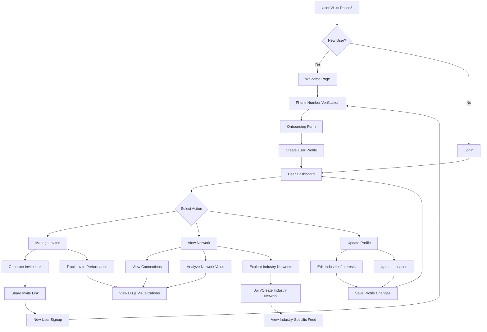
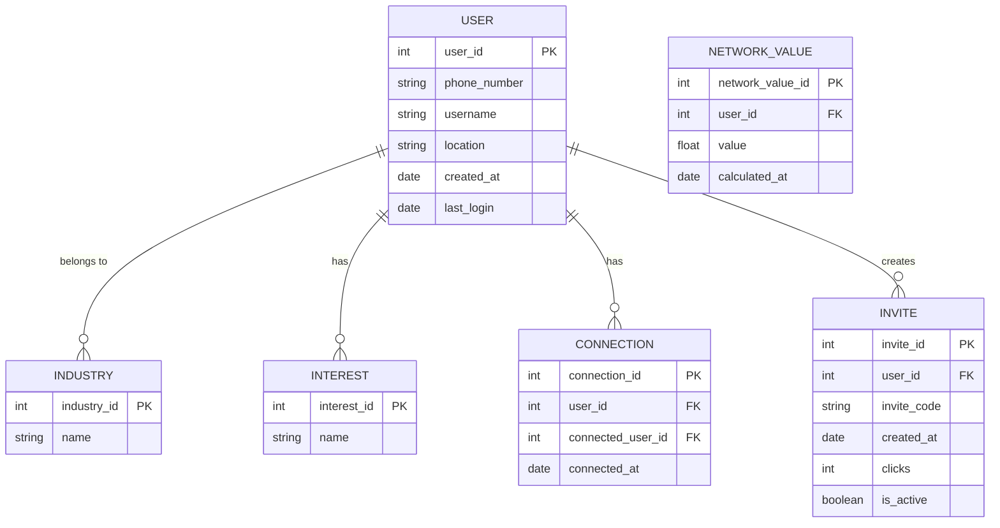
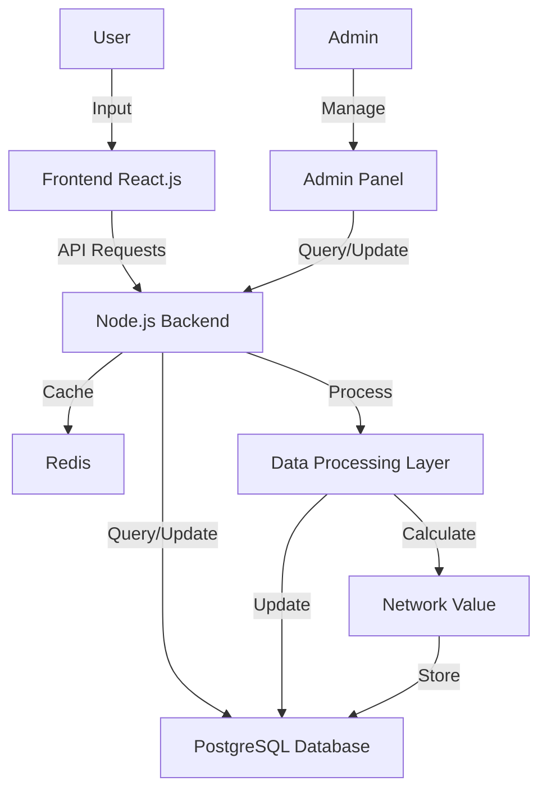

# 1. INTRODUCTION

## 1.1 PURPOSE

The purpose of this Software Requirements Specification (SRS) document is to provide a comprehensive and detailed description of the Pollen8 platform. This document serves as the primary reference for the technical and functional requirements of the system, ensuring alignment between stakeholders, developers, designers, and quality assurance teams throughout the development process.

This SRS is intended for the following audience:

1. Development Team: To guide the implementation of the Pollen8 platform, ensuring all features and functionalities are correctly understood and executed.
2. Project Managers: To plan project timelines, allocate resources, and track progress against defined requirements.
3. Quality Assurance Team: To develop test plans and cases based on the specified requirements.
4. Client Stakeholders: To review and approve the proposed functionality and ensure the platform meets their business needs.
5. UX/UI Designers: To align the user interface and experience with the specified requirements and functionalities.
6. System Architects: To design the overall system architecture that supports the defined requirements.
7. Future Maintenance Teams: To understand the system's original specifications for ongoing maintenance and potential upgrades.

## 1.2 SCOPE

Pollen8 is a cutting-edge web-based platform designed to revolutionize professional networking by providing a targeted, industry-specific approach to building and managing connections. The platform aims to address the challenges professionals face in establishing meaningful relationships within their industries and across related fields.

### Goals:

1. Facilitate targeted networking based on industry and interests
2. Provide users with valuable insights into their professional network's growth and value
3. Offer a seamless and engaging user experience through a minimalist, modern interface
4. Enable efficient management of professional connections and invitations

### Benefits:

1. Enhanced professional networking opportunities within specific industries
2. Data-driven insights to help users maximize the value of their connections
3. Streamlined user interface reducing distractions and focusing on core networking activities
4. Improved ability to track and manage professional relationships

### Core Functionalities:

1. User Onboarding:
   - Animated welcome page with secure phone number verification
   - Multi-step onboarding form for industry, interest, and location selection

2. User Profile Management:
   - Customizable profile with industry and interest metadata
   - Visual representation of user's professional network

3. Connection Management:
   - Generation and tracking of invite links
   - Analytics on connection growth and network value

4. Network Visualization:
   - Interactive graphs displaying network growth and activity
   - Industry-specific network views and feeds

5. Account Dashboard:
   - Real-time updates on connections, network value, and industry networks
   - Dynamic feed of network activities and updates

6. Responsive Design:
   - Seamless experience across desktop and mobile devices
   - Optimized performance for various screen sizes

The Pollen8 platform will be developed using React.js for the frontend, leveraging Tailwind CSS for styling. The backend will be built on Node.js, providing a robust and scalable server-side infrastructure. Data visualizations will be implemented using D3.js, offering interactive and insightful representations of user networks and activities.

By focusing on these core functionalities and leveraging modern web technologies, Pollen8 aims to provide a unique and valuable networking experience that sets it apart from traditional professional networking platforms.

## 2. PRODUCT DESCRIPTION

### 2.1 PRODUCT PERSPECTIVE

Pollen8 is a standalone web-based platform designed to revolutionize professional networking within specific industries. While it operates independently, it exists within the broader ecosystem of professional development and career advancement tools. The platform's unique position is defined by its focus on targeted, industry-specific networking, setting it apart from general-purpose social networking sites and traditional professional networking platforms.

Key aspects of Pollen8's perspective include:

1. Web-Based Architecture: Built using React.js for the frontend and Node.js for the backend, Pollen8 is accessible through modern web browsers, eliminating the need for native app installations.

2. Data Visualization Focus: Leveraging D3.js, the platform provides users with interactive and insightful representations of their professional networks, offering a unique value proposition in the networking space.

3. Minimalist Design Philosophy: The black-and-white aesthetic and clean user interface emphasize content and connections over visual clutter, aligning with modern UX trends.

4. API Integration: While primarily self-contained, Pollen8 integrates with third-party services for features such as location data, enhancing its functionality without compromising its core independence.

5. Scalable Infrastructure: Designed to accommodate growth in user base and feature set, the platform is built on cloud infrastructure, allowing for flexible scaling as demand increases.

### 2.2 PRODUCT FUNCTIONS

Pollen8 offers a range of functions designed to enhance professional networking experiences:

1. User Onboarding and Profile Creation
   - Animated welcome sequence
   - Secure phone number verification
   - Multi-step profile setup (industry, interests, location)

2. Connection Management
   - Generation and tracking of personalized invite links
   - Analytics on connection growth and network value

3. Network Visualization
   - Interactive graphs displaying network growth and activity
   - Industry-specific network views and feeds

4. Account Dashboard
   - Real-time updates on connections and network value
   - Dynamic feed of network activities and updates

5. Invite System
   - Creation and management of invite links
   - Tracking of invite performance and click-through rates

6. Industry-Specific Networking
   - Categorization of connections by industry
   - Creation and management of industry-specific sub-networks

7. Data-Driven Insights
   - Calculation and display of network value
   - Visualization of network growth over time

8. Responsive Design
   - Seamless experience across desktop and mobile devices
   - Optimized performance for various screen sizes

### 2.3 USER CHARACTERISTICS

Pollen8 is designed for a diverse range of professionals seeking to expand their industry-specific networks. The primary user groups include:

1. Young Professionals
   - Age: 22-35
   - Tech-savvy, early career stage
   - Seeking to build initial professional networks
   - Comfortable with digital platforms and data visualization

2. Mid-Career Professionals
   - Age: 35-50
   - Established in their fields, looking to expand influence
   - Value targeted connections over broad networking
   - May require some guidance with advanced platform features

3. Industry Leaders and Executives
   - Age: 45+
   - Highly experienced, seeking quality over quantity in connections
   - Interested in mentorship opportunities and industry insights
   - May have limited time for networking activities

4. Entrepreneurs and Freelancers
   - Various ages
   - Highly motivated networkers, seeking diverse connections
   - Value the platform's ability to quantify network value
   - Likely to be active in multiple industry networks

5. Career Changers
   - Various ages
   - Seeking to build new networks in target industries
   - Appreciate the platform's focus on industry-specific connections
   - May need additional support in navigating new professional landscapes

User Persona Example:

```
Name: Alex Chen
Age: 28
Occupation: Software Developer
Goals: 
- Expand professional network within the tech industry
- Find mentorship opportunities
- Stay updated on industry trends
Challenges:
- Limited time for traditional networking events
- Overwhelmed by broad, unfocused networking platforms
- Difficulty quantifying the value of professional connections
How Pollen8 Helps:
- Provides targeted tech industry connections
- Offers data-driven insights into network growth and value
- Allows efficient management of professional relationships through the platform
```

### 2.4 CONSTRAINTS

1. Technical Constraints
   - Limited to web browsers; no native mobile apps in initial release
   - Dependent on user devices having JavaScript enabled
   - Initial release supports English language only

2. Regulatory Constraints
   - Must comply with GDPR for European users
   - Adherence to CCPA for California residents
   - Data storage and transfer regulations in various jurisdictions

3. Business Constraints
   - Initial launch budget of $209,550
   - 7-month development timeline
   - Limited to 5-person core development team

4. User Interface Constraints
   - Strict adherence to black-and-white color scheme
   - Minimalist design philosophy may limit certain UI elements
   - Mobile responsiveness requires simplified layouts for smaller screens

5. Performance Constraints
   - Page load times must not exceed 2 seconds
   - System must support up to 100,000 users within 6 months of launch
   - Data visualizations must render smoothly on various devices

6. Security Constraints
   - All user data must be encrypted at rest and in transit
   - Compliance with industry-standard security protocols (e.g., OWASP guidelines)
   - Regular security audits and penetration testing required

### 2.5 ASSUMPTIONS AND DEPENDENCIES

Assumptions:

1. Users have access to modern web browsers and stable internet connections
2. The target audience is comfortable with and prefers minimalist, data-driven interfaces
3. There is a market demand for industry-specific professional networking platforms
4. Users are willing to share professional data for enhanced networking experiences
5. The black-and-white design will be perceived as modern and professional across various cultures

Dependencies:

1. Third-party Location Data API
   - Reliance on accurate and up-to-date location data for user profiles
   - Continued availability and pricing stability of the chosen API provider

2. Cloud Hosting Services
   - Dependence on reliable cloud infrastructure (e.g., AWS, Google Cloud) for hosting and scaling

3. Node.js and React.js Ecosystems
   - Ongoing support and updates for chosen versions of Node.js and React.js
   - Availability of necessary npm packages and their continued maintenance

4. D3.js Library
   - Compatibility of D3.js with chosen data visualization requirements
   - Continued development and support of the D3.js library

5. Web Browser Technologies
   - Consistent implementation of web standards across major browsers
   - Ongoing support for JavaScript features used in the application

6. Data Protection Regulations
   - Stability of current data protection laws and regulations
   - Ability to adapt to potential changes in international data protection requirements

7. User Adoption and Engagement
   - Dependency on user-generated content and connections to provide value
   - Reliance on early adopters to create a critical mass of users within target industries

8. Mobile Device Compatibility
   - Ongoing compatibility with a wide range of mobile devices and screen sizes
   - Ability to adapt to emerging mobile web technologies and standards

By clearly defining these product aspects, functions, user characteristics, constraints, assumptions, and dependencies, we establish a comprehensive understanding of the Pollen8 platform and its place within the professional networking ecosystem. This foundation will guide development decisions and ensure alignment with user needs and project goals throughout the implementation process.

Here's the PROCESS FLOWCHART section for the Pollen8 SRS using Mermaid JS, maintaining consistency with the previously mentioned technologies and frameworks:

## PROCESS FLOWCHART

The following flowchart illustrates the main user journey and key processes within the Pollen8 platform:



This flowchart outlines the core user journey within the Pollen8 platform, from initial signup to various actions a user can take. Key processes include:

1. User onboarding and verification
2. Profile creation and management
3. Invite generation and tracking
4. Network visualization and analysis
5. Industry-specific networking

The flowchart demonstrates how React.js components will handle different user interactions, while Node.js backend processes support data management and API calls. D3.js is integrated for network visualizations, providing users with interactive insights into their professional connections.

By following this process flow, the development team can ensure that all key features are implemented cohesively, creating a seamless user experience that aligns with Pollen8's goals of facilitating targeted, industry-specific networking.

Here's a breakdown of the Pollen8 platform into features, maintaining consistency with the previously mentioned technologies and frameworks:

## 1. USER ONBOARDING

### ID
F001

### DESCRIPTION
The user onboarding feature guides new users through the process of creating an account and setting up their profile on Pollen8.

### PRIORITY
High

### TABLE OF FUNCTIONAL REQUIREMENTS

| ID | Requirement | Description |
|----|-------------|-------------|
| F001-1 | Welcome Animation | Display animated "POLLEN8" text on the welcome page |
| F001-2 | Phone Verification | Implement secure phone number verification process |
| F001-3 | Industry Selection | Allow users to select at least 3 industries from a predefined list |
| F001-4 | Interest Selection | Enable users to choose at least 3 interests from a predefined list |
| F001-5 | Location Input | Implement ZIP code entry with auto-population of nearest city |
| F001-6 | Profile Creation | Create user profile based on entered information |

## 2. USER PROFILE MANAGEMENT

### ID
F002

### DESCRIPTION
This feature allows users to view and manage their profile information, including industries, interests, and location.

### PRIORITY
High

### TABLE OF FUNCTIONAL REQUIREMENTS

| ID | Requirement | Description |
|----|-------------|-------------|
| F002-1 | Profile Display | Show user's profile with metadata grid (industries, interests, location) |
| F002-2 | Profile Banner | Implement profile banner with pulsing white ring around avatar |
| F002-3 | Edit Profile | Allow users to update their industries, interests, and location |
| F002-4 | Profile Navigation | Provide buttons for "Manage Invites" and "Manage Account" |

## 3. INVITE MANAGEMENT

### ID
F003

### DESCRIPTION
This feature enables users to generate, track, and manage invite links for growing their network.

### PRIORITY
Medium

### TABLE OF FUNCTIONAL REQUIREMENTS

| ID | Requirement | Description |
|----|-------------|-------------|
| F003-1 | Generate Invite | Allow users to create new invite links with custom names |
| F003-2 | Invite List | Display a list of generated invite links with click counts |
| F003-3 | Activity Graph | Show 30-day activity graph for each invite link |
| F003-4 | Copy URL | Implement click-and-hold functionality to copy invite URL |
| F003-5 | Invite Tracking | Track and display the performance of each invite link |

## 4. NETWORK VISUALIZATION

### ID
F004

### DESCRIPTION
This feature provides users with visual representations of their professional network and its growth.

### PRIORITY
High

### TABLE OF FUNCTIONAL REQUIREMENTS

| ID | Requirement | Description |
|----|-------------|-------------|
| F004-1 | Connection Display | Show the number of connections in the user's network |
| F004-2 | Network Value | Calculate and display the user's network value |
| F004-3 | Growth Graph | Implement a D3.js line graph showing network growth over time |
| F004-4 | Industry Networks | Create a collapsible sidebar listing connected industries |
| F004-5 | Network Feed | Display a dynamic feed of network updates and activities |

## 5. DATA ANALYTICS

### ID
F005

### DESCRIPTION
This feature provides users with insights and analytics about their network and its value.

### PRIORITY
Medium

### TABLE OF FUNCTIONAL REQUIREMENTS

| ID | Requirement | Description |
|----|-------------|-------------|
| F005-1 | Connection Metrics | Calculate and display metrics on connection growth |
| F005-2 | Value Calculation | Implement algorithm to calculate network value (3.14 per connection) |
| F005-3 | Industry Insights | Provide analytics on the user's industry connections |
| F005-4 | Engagement Metrics | Track and display user engagement within the platform |
| F005-5 | Performance Dashboard | Create a real-time dashboard for monitoring system performance |

## 6. RESPONSIVE DESIGN

### ID
F006

### DESCRIPTION
This feature ensures that the Pollen8 platform is fully responsive and provides an optimal user experience across all devices.

### PRIORITY
High

### TABLE OF FUNCTIONAL REQUIREMENTS

| ID | Requirement | Description |
|----|-------------|-------------|
| F006-1 | Mobile Optimization | Ensure all pages are optimized for mobile devices |
| F006-2 | Tablet Compatibility | Implement responsive layouts for tablet screens |
| F006-3 | Desktop Experience | Optimize user interface for desktop browsers |
| F006-4 | Cross-Browser Support | Ensure compatibility with major web browsers |
| F006-5 | Responsive Components | Develop UI components that adapt to different screen sizes |

## 7. SECURITY AND AUTHENTICATION

### ID
F007

### DESCRIPTION
This feature implements robust security measures and user authentication processes to protect user data and ensure platform integrity.

### PRIORITY
High

### TABLE OF FUNCTIONAL REQUIREMENTS

| ID | Requirement | Description |
|----|-------------|-------------|
| F007-1 | Secure Login | Implement secure user authentication using phone numbers |
| F007-2 | Data Encryption | Ensure all user data is encrypted at rest and in transit |
| F007-3 | Access Control | Implement role-based access control for different user types |
| F007-4 | Security Auditing | Conduct regular security audits and penetration testing |
| F007-5 | Compliance | Ensure compliance with data protection regulations (GDPR, CCPA) |

These features align with the previously mentioned technologies: React.js for the frontend, Node.js for the backend, D3.js for data visualizations, and a focus on a minimalist, black-and-white design aesthetic. The features are designed to work cohesively to provide a comprehensive, secure, and user-friendly professional networking experience on the Pollen8 platform.

## NON-FUNCTIONAL REQUIREMENTS

### PERFORMANCE

1. Response Time:
   - Web pages must load within 2 seconds on desktop devices with a standard broadband connection (>10 Mbps).
   - API responses must be delivered within 200ms for 95% of requests under normal load conditions.
   - D3.js visualizations must render within 1 second for datasets up to 1000 nodes.

2. Throughput:
   - The system must support at least 1000 concurrent users without degradation in performance.
   - The platform should handle a minimum of 100 API requests per second.

3. Resource Usage:
   - Client-side application should not exceed 50MB of browser memory usage.
   - Server-side processes should not exceed 70% CPU utilization under normal load.
   - Database queries should complete within 100ms for 90% of requests.

### SAFETY

1. Data Backup:
   - Automated daily backups of all user data and system configurations.
   - Ability to restore from backups within 4 hours in case of data loss.

2. Fault Tolerance:
   - Implement redundancy for critical system components to ensure 99.9% uptime.
   - Graceful degradation of non-critical features during partial system failures.

3. Error Handling:
   - Comprehensive error logging and monitoring system to detect and alert on critical issues.
   - User-friendly error messages that do not expose sensitive system information.

### SECURITY

1. Authentication:
   - Multi-factor authentication for user accounts using phone number verification.
   - Session management with secure, HttpOnly cookies and proper expiration policies.

2. Authorization:
   - Role-based access control (RBAC) for different user types (e.g., regular users, administrators).
   - Granular permissions for accessing and modifying user data and network information.

3. Data Encryption:
   - All data in transit must be encrypted using TLS 1.3 or higher.
   - Sensitive data at rest (e.g., user credentials) must be encrypted using industry-standard algorithms (e.g., AES-256).

4. Privacy:
   - Compliance with GDPR and CCPA regulations for user data protection.
   - Implement data minimization principles, collecting only necessary information.
   - Provide users with the ability to export and delete their data.

### QUALITY

1. Availability:
   - The system must maintain 99.9% uptime, allowing for scheduled maintenance windows.
   - Implement automated health checks and self-healing mechanisms for critical services.

2. Maintainability:
   - Adhere to React.js and Node.js best practices and coding standards.
   - Maintain comprehensive documentation for all APIs and system components.
   - Implement automated testing with a minimum of 80% code coverage.

3. Usability:
   - The user interface must be accessible and comply with WCAG 2.1 Level AA standards.
   - The platform should support the latest two versions of major browsers (Chrome, Firefox, Safari, Edge).
   - Implement responsive design to support devices with screen sizes from 320px to 2560px width.

4. Scalability:
   - The architecture must support horizontal scaling to handle up to 1 million registered users.
   - Database design should support efficient querying and indexing for large datasets.
   - Implement caching mechanisms (e.g., Redis) to reduce database load for frequently accessed data.

5. Reliability:
   - The system should have a Mean Time Between Failures (MTBF) of at least 720 hours.
   - Implement automated rollback mechanisms for failed deployments.
   - Conduct regular stress testing to ensure system stability under peak loads.

### COMPLIANCE

1. Legal:
   - Comply with all applicable data protection laws, including GDPR and CCPA.
   - Implement age verification mechanisms to comply with COPPA regulations.
   - Maintain clear and up-to-date Terms of Service and Privacy Policy documents.

2. Regulatory:
   - Adhere to industry-specific regulations for storing and processing user data.
   - Implement audit trails for all data access and modifications to support compliance requirements.

3. Standards:
   - Follow OWASP Top 10 guidelines for web application security.
   - Adhere to ISO/IEC 27001 standards for information security management.
   - Implement logging and monitoring in compliance with PCI DSS requirements, if handling payment information.

4. Accessibility:
   - Comply with Section 508 of the Rehabilitation Act for accessibility.
   - Provide alternative text for all images and non-text content.
   - Ensure keyboard navigation for all platform functionalities.

5. Internationalization:
   - Support UTF-8 encoding for proper display of international characters.
   - Design the database and UI to accommodate future multi-language support.

These non-functional requirements align with the previously mentioned technologies and frameworks, including React.js for the frontend, Node.js for the backend, and D3.js for data visualizations. They ensure that the Pollen8 platform will be performant, secure, high-quality, and compliant with relevant standards and regulations.

## DATA REQUIREMENTS

### DATA MODELS

The Pollen8 platform utilizes a relational database structure to efficiently store and manage user data, connections, and platform activities. The following entity-relationship diagram illustrates the core data model:



This data model supports the core functionalities of Pollen8, including user profiles, industry and interest associations, connections between users, invite management, and network value calculations.

### DATA STORAGE

Pollen8 will utilize a robust and scalable data storage solution to ensure data integrity, availability, and performance. The following strategies will be implemented:

1. **Primary Database**: 
   - Technology: PostgreSQL
   - Purpose: Store all relational data including user profiles, connections, and platform activities

2. **Caching Layer**:
   - Technology: Redis
   - Purpose: Cache frequently accessed data to reduce database load and improve response times

3. **Data Retention**:
   - User data will be retained indefinitely while the account is active
   - Deleted accounts will have personal data anonymized after 30 days, with non-personal data retained for analytics

4. **Redundancy**:
   - Implement database replication with at least one standby replica
   - Use multi-availability zone deployment in the cloud infrastructure

5. **Backup**:
   - Daily full backups of the PostgreSQL database
   - Continuous incremental backups throughout the day
   - Backups stored in a separate geographic region for disaster recovery

6. **Recovery**:
   - Implement point-in-time recovery capability
   - Regular disaster recovery drills to ensure RTO (Recovery Time Objective) of 4 hours and RPO (Recovery Point Objective) of 15 minutes

7. **Scalability**:
   - Utilize database sharding for horizontal scaling as user base grows
   - Implement read replicas to distribute database load for read-heavy operations

### DATA PROCESSING

Pollen8's data processing pipeline ensures secure, efficient handling of user data and platform activities. The following measures and processes will be implemented:

1. **Data Security**:
   - Encryption at rest using AES-256 for all stored data
   - Encryption in transit using TLS 1.3 for all API communications
   - Implement role-based access control (RBAC) for internal data access
   - Regular security audits and penetration testing

2. **Data Flow**:
   The following diagram illustrates the high-level data flow within the Pollen8 platform:



3. **Data Validation**:
   - Implement input validation on both client-side (React.js) and server-side (Node.js)
   - Use JSON Schema for API payload validation

4. **Data Transformation**:
   - Implement ETL (Extract, Transform, Load) processes for data migration and updates
   - Use data normalization techniques to ensure data consistency

5. **Real-time Processing**:
   - Implement WebSocket connections for real-time updates on user activities and network changes
   - Use message queues (e.g., RabbitMQ) for handling asynchronous tasks like invite processing and network value calculations

6. **Data Analytics**:
   - Implement a separate analytics database (e.g., Amazon Redshift) for complex queries and reporting
   - Use batch processing for daily aggregations and trend analysis

7. **Compliance**:
   - Implement data anonymization techniques for analytics and testing environments
   - Provide data export functionality to comply with data portability requirements (GDPR, CCPA)
   - Maintain audit logs for all data access and modifications

By implementing these data requirements, Pollen8 ensures a robust, secure, and scalable foundation for managing user data and platform activities. The chosen technologies (React.js, Node.js, PostgreSQL, Redis) provide a consistent and efficient ecosystem for data processing and storage, aligning with the overall architecture of the platform.

## EXTERNAL INTERFACES

### USER INTERFACES

The Pollen8 platform will feature a minimalist, black-and-white user interface designed for optimal user experience across desktop and mobile devices. The interface will be built using React.js components styled with Tailwind CSS, ensuring consistency and responsiveness throughout the application.

Key user interface requirements include:

1. Welcome Page:
   - Animated "POLLEN8" text centered on the screen
   - "GET CONNECTED" button with white background and black text
   - Phone number input field with placeholder text

2. Onboarding Form:
   - Multi-step form with progress indicator
   - Dropdown checkbox fields for industry and interest selection
   - ZIP code input with auto-population of nearest city

3. User Profile Page:
   - Profile banner with pulsing white ring around avatar
   - Metadata grid displaying user's industries, interests, and location
   - Action buttons for "Manage Invites" and "Manage Account"

4. Invite Management Page:
   - List view of generated invite links with click counts
   - Expandable rows showing 30-day activity graphs
   - "GENERATE LINK" button and link creation interface

5. Account Page:
   - Animated star constellation background in profile banner
   - Network statistics display (connections count, network value)
   - Collapsible sidebar for industry networks
   - Dynamic network feed based on selected view

Placeholder for UI mockups:
```
[Placeholder for Welcome Page mockup]
[Placeholder for Onboarding Form mockup]
[Placeholder for User Profile Page mockup]
[Placeholder for Invite Management Page mockup]
[Placeholder for Account Page mockup]
```

All user interfaces will adhere to WCAG 2.1 Level AA accessibility standards and will be optimized for both desktop and mobile viewing.

### SOFTWARE INTERFACES

Pollen8 will interact with several external software systems and components to provide its full range of functionality:

1. Node.js Backend API:
   - RESTful API endpoints for all frontend functionalities
   - JSON data format for request and response payloads
   - JWT-based authentication for secure communication

2. PostgreSQL Database:
   - Interface for storing and retrieving user data, connections, and platform activities
   - Connection managed through Node.js ORM (e.g., Sequelize or TypeORM)

3. Redis Cache:
   - Interface for caching frequently accessed data to improve performance
   - Used for session management and rate limiting

4. Location Data API:
   - External API for retrieving city information based on ZIP codes
   - RESTful API with JSON response format
   - Requires API key for authentication

5. Email Service Provider API:
   - Interface for sending transactional emails (e.g., verification, notifications)
   - SMTP or HTTP API depending on the chosen provider
   - Requires API key and secure connection (TLS/SSL)

6. Cloud Storage Service:
   - Interface for storing and retrieving user-generated content (e.g., profile pictures)
   - S3-compatible API for object storage
   - Requires access key and secret for authentication

7. Monitoring and Logging Service:
   - Interface for sending application logs and performance metrics
   - HTTP API for log ingestion
   - Requires API key for authentication

### COMMUNICATION INTERFACES

Pollen8 will utilize the following communication interfaces to ensure secure and efficient data exchange:

1. HTTPS Protocol:
   - All client-server communication will be encrypted using TLS 1.3 or higher
   - SSL certificates will be implemented for secure connections

2. WebSocket:
   - Used for real-time updates on user activities and network changes
   - Secure WebSocket (WSS) protocol will be implemented for encrypted communication

3. RESTful API:
   - HTTP methods (GET, POST, PUT, DELETE) for CRUD operations
   - JSON data format for request and response bodies
   - API versioning to ensure backward compatibility

4. GraphQL API (optional):
   - May be implemented for more efficient data fetching on complex queries
   - Uses a single endpoint with POST requests
   - Introspection for self-documenting API structure

5. OAuth 2.0:
   - Used for secure authorization with third-party services (if implemented in future phases)

6. SMTP:
   - Used for sending emails through the chosen email service provider
   - TLS encryption for secure email transmission

7. Content Delivery Network (CDN):
   - Interface for serving static assets (images, CSS, JavaScript files)
   - HTTPS protocol for secure content delivery

8. Database Connection:
   - Encrypted connection to PostgreSQL database using SSL
   - Connection pooling for efficient resource utilization

These communication interfaces ensure that Pollen8 can securely and efficiently exchange data with its various components and external services while maintaining the performance and scalability required for a modern web application.

## APPENDICES

### GLOSSARY

1. **Pollen8**: The name of the professional networking platform being developed.

2. **Network Value**: A metric calculated by the platform to represent the worth of a user's professional connections (3.14 per connection).

3. **Industry Network**: A group of connections within the platform specific to a particular industry or field.

4. **Invite Link**: A unique URL generated by users to invite others to join the Pollen8 platform.

5. **Metadata Grid**: A visual representation of a user's selected industries, interests, and location on their profile page.

6. **Star Constellation**: An animated background feature on the Account Page representing the user's network.

7. **Pulsing White Ring**: A visual effect around the user's avatar on the profile banner to draw attention.

8. **Onboarding Form**: The multi-step process new users complete to set up their profile, including industry and interest selection.

### ACRONYMS

1. **API**: Application Programming Interface
2. **CSS**: Cascading Style Sheets
3. **CRUD**: Create, Read, Update, Delete
4. **D3.js**: Data-Driven Documents JavaScript library
5. **GDPR**: General Data Protection Regulation
6. **HTML**: Hypertext Markup Language
7. **HTTP**: Hypertext Transfer Protocol
8. **HTTPS**: Hypertext Transfer Protocol Secure
9. **JSON**: JavaScript Object Notation
10. **JWT**: JSON Web Token
11. **MVP**: Minimum Viable Product
12. **ORM**: Object-Relational Mapping
13. **REST**: Representational State Transfer
14. **SPA**: Single Page Application
15. **SSL**: Secure Sockets Layer
16. **UI**: User Interface
17. **UX**: User Experience
18. **WSS**: WebSocket Secure

### ADDITIONAL REFERENCES

1. React.js Documentation: https://reactjs.org/docs/getting-started.html
   - Official documentation for the React.js library used in frontend development.

2. Node.js Documentation: https://nodejs.org/en/docs/
   - Comprehensive guide for the Node.js runtime used in backend development.

3. D3.js Documentation: https://d3js.org/
   - Reference for the D3.js library used for data visualizations.

4. Tailwind CSS Documentation: https://tailwindcss.com/docs
   - Guide for the utility-first CSS framework used for styling.

5. PostgreSQL Documentation: https://www.postgresql.org/docs/
   - Reference for the relational database used in the project.

6. OWASP Web Security Testing Guide: https://owasp.org/www-project-web-security-testing-guide/
   - Comprehensive resource for web application security testing.

7. Web Content Accessibility Guidelines (WCAG) 2.1: https://www.w3.org/TR/WCAG21/
   - Standards for web content accessibility to ensure the platform is usable by all.

8. Redis Documentation: https://redis.io/documentation
   - Guide for the in-memory data structure store used for caching.

9. WebSocket API: https://developer.mozilla.org/en-US/docs/Web/API/WebSockets_API
   - Documentation for the WebSocket protocol used for real-time communication.

10. JWT.io: https://jwt.io/introduction/
    - Introduction to JSON Web Tokens used for secure information transmission.

These additional references provide valuable resources for the development team, covering various aspects of the technologies and best practices used in the Pollen8 project. They serve as supplementary material to the main SRS document and can be consulted for more detailed information on specific topics.