# 1. INTRODUCTION

## 1.1 SYSTEM OVERVIEW

Pollen8 is a cutting-edge web-based platform designed to revolutionize professional networking by providing a targeted, industry-specific approach to building and managing connections. The system is built using modern web technologies and follows a client-server architecture, emphasizing a minimalist, black-and-white aesthetic for its user interface.

### 1.1.1 High-Level Architecture

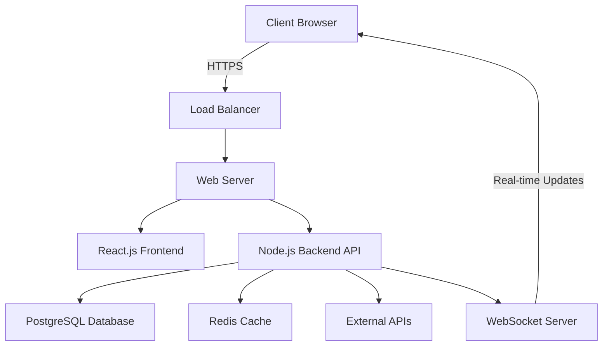

### 1.1.2 Key Components

1. **Frontend (Client-Side)**
   - Built with React.js for dynamic and responsive user interfaces
   - Styled using Tailwind CSS for consistent, minimalist design
   - Utilizes D3.js for interactive data visualizations

2. **Backend (Server-Side)**
   - Node.js server providing RESTful API endpoints
   - Express.js framework for routing and middleware management
   - JWT-based authentication for secure user sessions

3. **Database**
   - PostgreSQL for primary data storage
   - Redis for caching and session management

4. **External Integrations**
   - Location Data API for ZIP code to city mapping
   - Email Service Provider API for transactional emails

5. **DevOps & Infrastructure**
   - Containerized deployment using Docker
   - Cloud-based hosting (e.g., AWS, Google Cloud)
   - CI/CD pipeline for automated testing and deployment

### 1.1.3 Core Features

| Feature | Description |
|---------|-------------|
| User Onboarding | Animated welcome, phone verification, and profile setup |
| Profile Management | Industry and interest selection, location setting |
| Network Visualization | Interactive graphs showing connections and growth |
| Invite System | Generation and tracking of personalized invite links |
| Industry Networks | Creation and management of industry-specific sub-networks |
| Data Analytics | Network value calculation and performance insights |

### 1.1.4 Technical Specifications

- **Frontend Framework**: React.js 17.0.2
- **CSS Framework**: Tailwind CSS 2.2.19
- **Backend Runtime**: Node.js 14.17.6
- **API Framework**: Express.js 4.17.1
- **Database**: PostgreSQL 13.4
- **Caching**: Redis 6.2.5
- **Data Visualization**: D3.js 7.1.1
- **Authentication**: JSON Web Tokens (JWT)
- **API Protocol**: RESTful with JSON payloads
- **Real-time Communication**: WebSocket (Socket.io 4.2.0)

This system overview provides a high-level understanding of the Pollen8 platform, its architecture, key components, core features, and technical specifications. The design emphasizes scalability, performance, and a seamless user experience, aligning with the platform's goal of revolutionizing professional networking through targeted, industry-specific connections.

# 3. SYSTEM ARCHITECTURE

## 3.1 PROGRAMMING LANGUAGES

The Pollen8 platform will utilize the following programming languages, chosen for their suitability to the project requirements, ecosystem support, and alignment with modern web development practices:

| Language | Purpose | Justification |
|----------|---------|---------------|
| JavaScript (ES6+) | Frontend and Backend development | Versatile language that allows for full-stack development, extensive ecosystem, and wide community support |
| TypeScript | Enhanced JavaScript development | Adds static typing to JavaScript, improving code quality and maintainability |
| HTML5 | Frontend structure | Latest standard for web content structure, providing semantic elements and improved accessibility |
| CSS3 | Frontend styling | Modern styling capabilities, including flexbox and grid layouts for responsive design |
| SQL | Database queries | Standard language for relational database operations, used with PostgreSQL |

## 3.2 HIGH-LEVEL ARCHITECTURE DIAGRAM

The following diagram provides an overview of the Pollen8 system architecture:

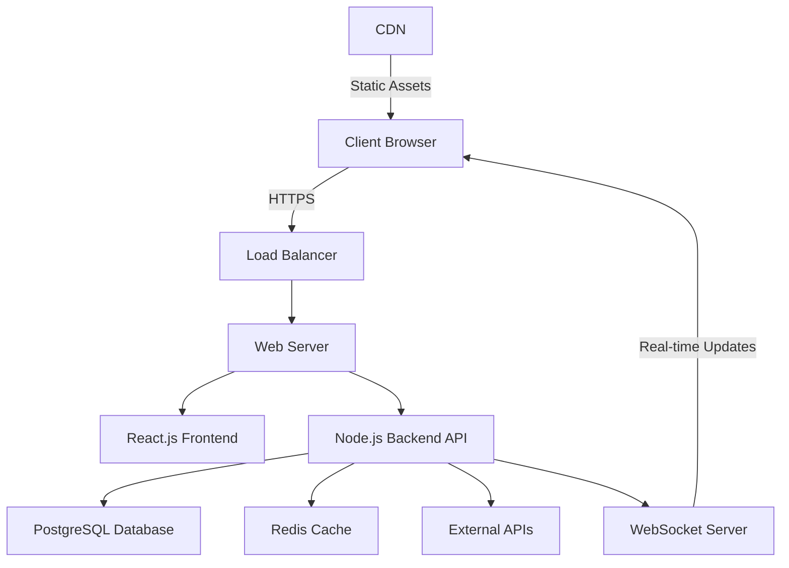

This architecture ensures scalability, performance, and separation of concerns within the Pollen8 platform.

## 3.3 COMPONENT DIAGRAMS

### 3.3.1 Frontend Components

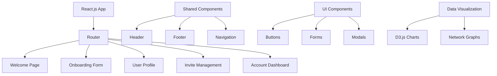

### 3.3.2 Backend Components

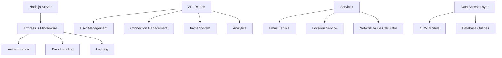

## 3.4 SEQUENCE DIAGRAMS

### 3.4.1 User Registration Process

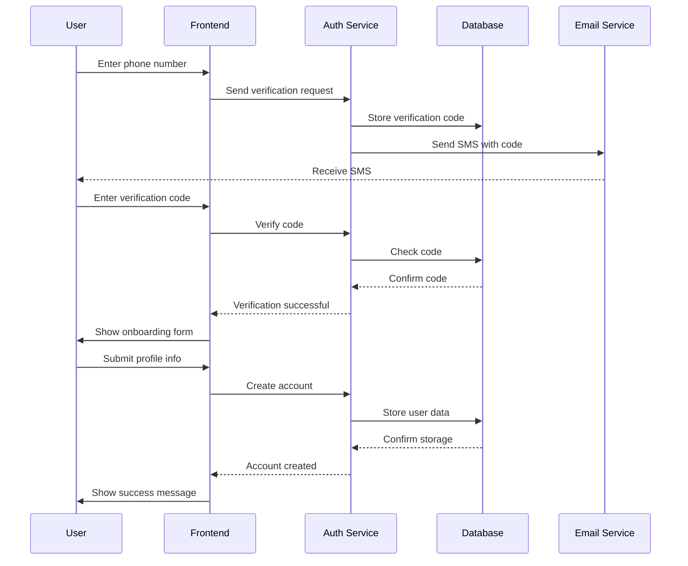

## 3.5 DATA-FLOW DIAGRAM

The following diagram illustrates how data flows through the Pollen8 system:

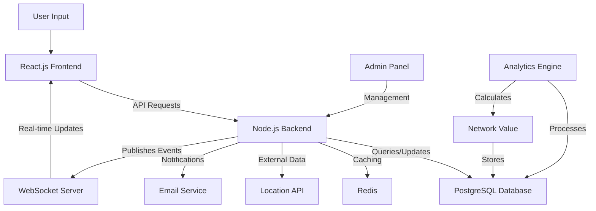

This data flow diagram demonstrates how information moves through the Pollen8 system, from user input through various processing stages and back to the user interface. It highlights the role of caching, external services, and real-time updates in the overall data architecture.

The system architecture outlined above provides a comprehensive view of the Pollen8 platform's structure, components, and data flow. It maintains consistency with the previously mentioned technologies and frameworks, including React.js for the frontend, Node.js for the backend, PostgreSQL for data storage, and Redis for caching. This architecture is designed to support the platform's requirements for performance, scalability, and real-time functionality in professional networking.

# 4. SYSTEM DESIGN

## 4.1 PROGRAMMING LANGUAGES

The Pollen8 platform will utilize the following programming languages, chosen for their suitability to the project requirements, ecosystem support, and alignment with modern web development practices:

| Language | Purpose | Justification |
|----------|---------|---------------|
| JavaScript (ES6+) | Frontend and Backend development | Versatile language that allows for full-stack development, extensive ecosystem, and wide community support |
| TypeScript | Enhanced JavaScript development | Adds static typing to JavaScript, improving code quality and maintainability |
| HTML5 | Frontend structure | Latest standard for web content structure, providing semantic elements and improved accessibility |
| CSS3 | Frontend styling | Modern styling capabilities, including flexbox and grid layouts for responsive design |
| SQL | Database queries | Standard language for relational database operations, used with PostgreSQL |

## 4.2 DATABASE DESIGN

Pollen8 will use PostgreSQL as its primary relational database. The database schema is designed to efficiently store and manage user data, connections, and platform activities.

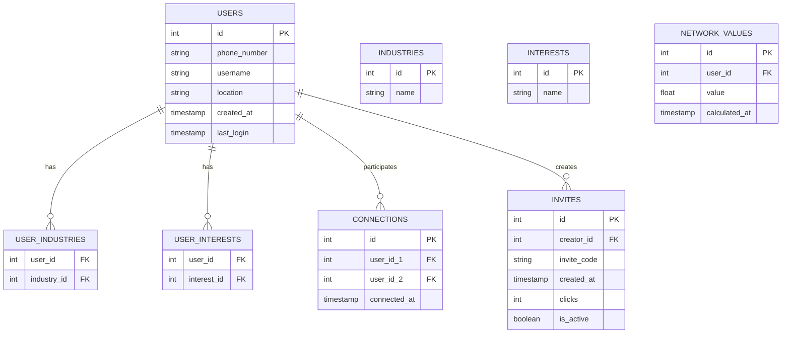

This schema supports the core functionalities of Pollen8, including user profiles, industry and interest associations, connections between users, invite management, and network value calculations.

## 4.3 API DESIGN

Pollen8 will implement a RESTful API using Node.js and Express.js. The API will follow best practices for versioning, authentication, and error handling.

### 4.3.1 API Endpoints

| Endpoint | Method | Description |
|----------|--------|-------------|
| `/api/v1/auth/register` | POST | Register a new user |
| `/api/v1/auth/login` | POST | Authenticate a user |
| `/api/v1/users/:id` | GET | Retrieve user profile |
| `/api/v1/users/:id` | PUT | Update user profile |
| `/api/v1/connections` | GET | List user connections |
| `/api/v1/connections` | POST | Create a new connection |
| `/api/v1/invites` | POST | Generate a new invite |
| `/api/v1/invites/:code` | GET | Retrieve invite details |
| `/api/v1/network-value/:id` | GET | Get user's network value |

### 4.3.2 Authentication

The API will use JWT (JSON Web Tokens) for authentication. Each request to a protected endpoint must include a valid JWT in the Authorization header.

### 4.3.3 Error Handling

The API will use standard HTTP status codes and return error messages in a consistent JSON format:

```json
{
  "error": {
    "code": 400,
    "message": "Invalid input",
    "details": "Username must be at least 3 characters long"
  }
}
```

## 4.4 USER INTERFACE DESIGN

The Pollen8 user interface will be built using React.js components styled with Tailwind CSS, adhering to a minimalist black-and-white aesthetic.

### 4.4.1 Key UI Components

1. Welcome Page
   - Animated "POLLEN8" text (fade-in/fade-out)
   - "GET CONNECTED" button (white background, black text)
   - Phone number input field

2. Onboarding Form
   - Multi-step form with progress indicator
   - Industry selection (minimum 3)
   - Interest selection (minimum 3)
   - ZIP code input with auto-population

3. User Profile Page
   - Profile banner with pulsing avatar
   - Metadata grid (industries, interests, location)
   - Action buttons ("Manage Invites", "Manage Account")

4. Invite Management Page
   - List of invite links with click counts
   - 30-day activity graphs (using D3.js)
   - "GENERATE LINK" button and creation interface

5. Account Page
   - Animated star constellation background
   - Network statistics display
   - Collapsible industry networks sidebar
   - Dynamic network feed

### 4.4.2 UI Layout

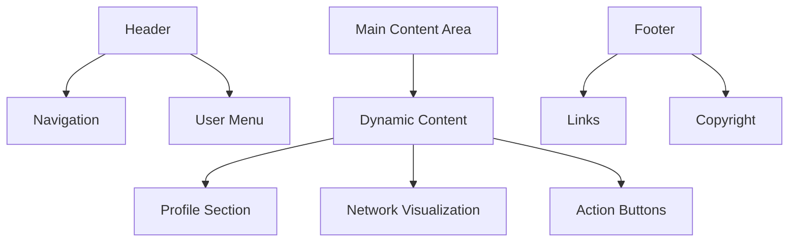

### 4.4.3 Responsive Design

The UI will be fully responsive, adapting to various screen sizes:

- Mobile: Single column layout, collapsible menus
- Tablet: Two-column layout for certain sections
- Desktop: Full multi-column layout with sidebar

### 4.4.4 Accessibility

The UI will adhere to WCAG 2.1 Level AA standards, including:

- Proper color contrast (4.5:1 for normal text)
- Keyboard navigation support
- ARIA labels for interactive elements
- Scalable text and responsive images

This system design aligns with the previously mentioned technologies and frameworks, including React.js for the frontend, Node.js for the backend, PostgreSQL for data storage, and D3.js for data visualizations. It provides a comprehensive blueprint for the development of the Pollen8 platform, ensuring a cohesive and efficient implementation of all required features and functionalities.

# TECHNOLOGY STACK

## PROGRAMMING LANGUAGES

The following programming languages have been selected for the Pollen8 project, based on their suitability for the required tasks, ecosystem support, and alignment with modern web development practices:

| Language | Purpose | Justification |
|----------|---------|---------------|
| JavaScript (ES6+) | Frontend and Backend development | Versatile language allowing for full-stack development, extensive ecosystem, and wide community support |
| TypeScript | Enhanced JavaScript development | Adds static typing to JavaScript, improving code quality, maintainability, and developer productivity |
| HTML5 | Frontend structure | Latest standard for web content structure, providing semantic elements and improved accessibility |
| CSS3 | Frontend styling | Modern styling capabilities, including flexbox and grid layouts for responsive design |
| SQL | Database queries | Standard language for relational database operations, used with PostgreSQL |

## FRAMEWORKS AND LIBRARIES

The following frameworks and libraries will be utilized in the Pollen8 project:

| Framework/Library | Purpose | Version |
|-------------------|---------|---------|
| React.js | Frontend UI development | 17.0.2 |
| Node.js | Backend runtime environment | 14.17.6 |
| Express.js | Backend web application framework | 4.17.1 |
| Tailwind CSS | Utility-first CSS framework for styling | 2.2.19 |
| D3.js | Data visualization library | 7.1.1 |
| Socket.io | Real-time bidirectional event-based communication | 4.2.0 |
| Jest | JavaScript testing framework | 27.0.6 |
| Sequelize | ORM for PostgreSQL | 6.6.5 |
| Redis client | Node.js Redis client for caching | 3.1.2 |
| JSON Web Token (jsonwebtoken) | JWT implementation for Node.js | 8.5.1 |

## DATABASES

Pollen8 will employ the following database systems:

| Database | Purpose | Version |
|----------|---------|---------|
| PostgreSQL | Primary relational database for storing user data, connections, and platform activities | 13.4 |
| Redis | In-memory data structure store for caching and session management | 6.2.5 |

## THIRD-PARTY SERVICES

The following external services and APIs will be integrated into the Pollen8 system:

| Service | Purpose | API Type |
|---------|---------|----------|
| Location Data API | Retrieve city information based on ZIP codes | RESTful |
| Email Service Provider API | Send transactional emails for verification and notifications | SMTP or HTTP |
| Cloud Storage Service | Store and retrieve user-generated content (e.g., profile pictures) | S3-compatible |
| Monitoring and Logging Service | Collect application logs and performance metrics | HTTP |

## TECHNOLOGY STACK DIAGRAM

The following diagram illustrates the overall technology stack of the Pollen8 platform:

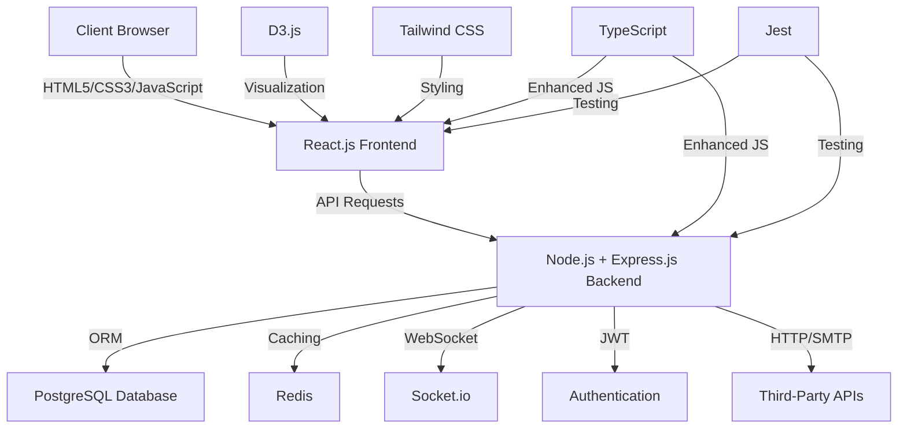

This technology stack has been carefully selected to provide a robust, scalable, and maintainable foundation for the Pollen8 platform. It leverages modern web technologies and best practices to ensure efficient development and optimal performance.

# SECURITY CONSIDERATIONS

## AUTHENTICATION AND AUTHORIZATION

Pollen8 implements a robust authentication and authorization system to ensure secure access to user accounts and data.

### Authentication

1. **Phone Number Verification**
   - Users register and log in using their phone numbers
   - A one-time password (OTP) is sent via SMS for verification
   - OTP expires after 5 minutes for security

2. **JSON Web Tokens (JWT)**
   - Upon successful authentication, a JWT is issued to the client
   - JWTs are used for subsequent API requests to maintain session state
   - Tokens expire after 24 hours, requiring re-authentication

3. **Multi-Factor Authentication (MFA)**
   - Optional feature for users to enable additional security
   - Implements Time-based One-Time Password (TOTP) as a second factor

### Authorization

Pollen8 uses Role-Based Access Control (RBAC) to manage user permissions:

| Role | Permissions |
|------|-------------|
| User | - View own profile<br>- Manage connections<br>- Generate and manage invites<br>- View network analytics |
| Admin | - All User permissions<br>- Access admin dashboard<br>- Manage user accounts<br>- View system-wide analytics |

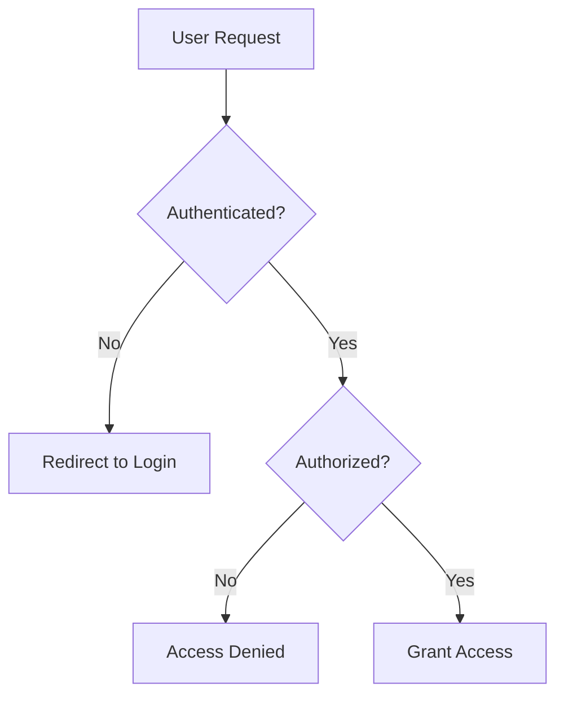

## DATA SECURITY

Pollen8 prioritizes the protection of user data through various security measures:

1. **Encryption at Rest**
   - All sensitive data in the PostgreSQL database is encrypted using AES-256
   - Encryption keys are managed using a key management service (e.g., AWS KMS)

2. **Encryption in Transit**
   - All data transmitted between client and server is encrypted using TLS 1.3
   - HTTPS is enforced for all connections

3. **Data Minimization**
   - Only essential user data is collected and stored
   - Personal data is pseudonymized where possible

4. **Secure Data Deletion**
   - User data is securely erased upon account deletion
   - Data retention policies are implemented to comply with regulations

5. **Database Security**
   - Database access is restricted to application servers only
   - Regular security audits and vulnerability assessments are conducted

6. **Backup and Recovery**
   - Daily encrypted backups of all user data
   - Backup data is stored in a separate, secure location
   - Regular recovery drills to ensure data can be restored if needed

## SECURITY PROTOCOLS

Pollen8 adheres to industry-standard security protocols and best practices:

1. **OWASP Top 10**
   - Regular security assessments against OWASP Top 10 vulnerabilities
   - Implementation of security controls to mitigate common web application risks

2. **Security Headers**
   - Implementation of security headers including:
     - Content Security Policy (CSP)
     - X-XSS-Protection
     - X-Frame-Options
     - X-Content-Type-Options

3. **Input Validation**
   - All user inputs are validated and sanitized on both client and server-side
   - Parameterized queries are used to prevent SQL injection attacks

4. **Rate Limiting**
   - API rate limiting to prevent abuse and DDoS attacks
   - Implements exponential backoff for repeated failed login attempts

5. **Logging and Monitoring**
   - Comprehensive logging of all security-related events
   - Real-time monitoring and alerting for suspicious activities
   - Use of a Security Information and Event Management (SIEM) system

6. **Vulnerability Management**
   - Regular vulnerability scans of the application and infrastructure
   - Timely application of security patches and updates

7. **Incident Response Plan**
   - Documented procedures for handling security incidents
   - Regular drills to ensure team readiness

8. **Third-Party Security**
   - Regular security assessments of third-party integrations
   - Vendor risk management program to ensure security of the supply chain

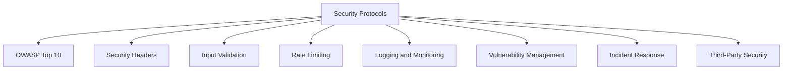

These security considerations are designed to work in harmony with the previously mentioned technologies and frameworks, including React.js for the frontend, Node.js for the backend, and PostgreSQL for data storage. By implementing these measures, Pollen8 aims to provide a secure and trustworthy platform for professional networking.